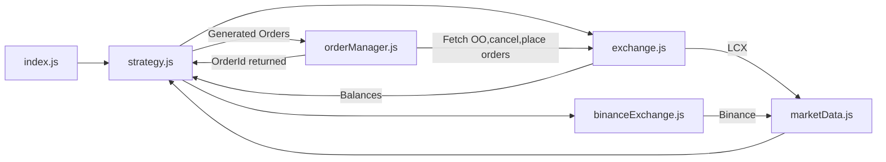

# LCX Market Maker Bot

market making bot that interacts with LCX and Binance exchanges to fetch market data and places orders on LCX using Binance Prices

## Features

- Fetches market data from LCX and Binance.
- Generates and places orders based on current position and defined maximum spread
- Manages open orders.
- Fetches account balances.
- Fetches Pair Details (MinOrder,Accuracy..)
  

## Project Structure

- `exchange.js`: Contains methods to interact with the LCX exchange API.
- `binanceExchange.js`: Contains methods to interact with the Binance exchange API.
- `marketData.js`: Fetches market data from LCX and Binance.
- `orderManager.js`: Manages the placing and canceling of orders.
- `strategy.js`: Implements the market making strategy.
- `index.js`: Contains initialisation details (Pair, Inventory..)

## Project Flow

## Improvements Scope [To be completed]
- [ ] Get API credentials and implement orderID callbacks
- [x] Fetch pair details using API
- [ ] modify prices for pair not available on Binance
- [x] Make strategy position dependent


## Installation

1. Clone the repository:
   ```sh
   git clone https://github.com/ShivamGupta0/LCX_MM_bot.git
   cd LCX_MM_bot
2. install dependencies:
   ```sh
   npm install
3. Run the Market Making Bot:
   ```sh
   node index.js
